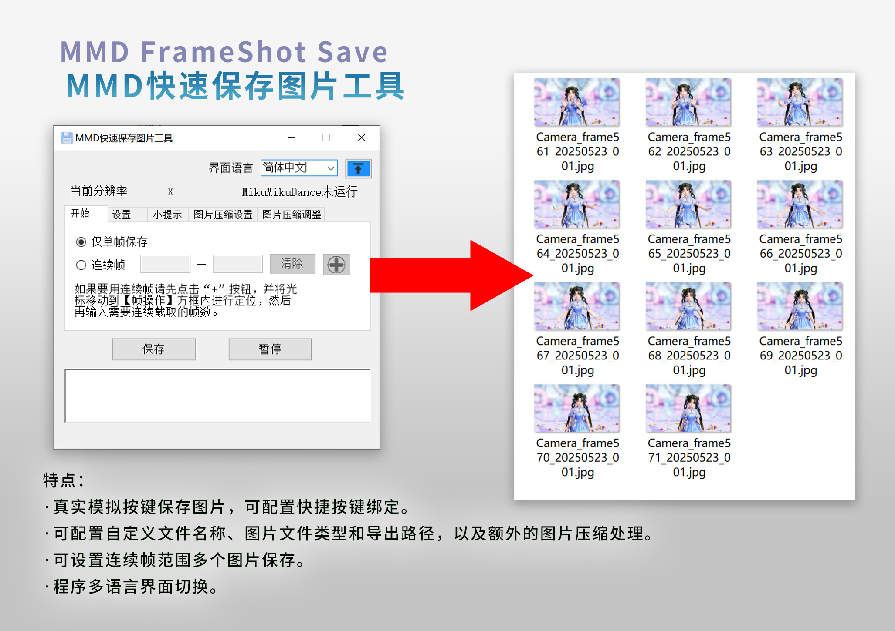

<h1 align="center">MMD FrameShot Save</h1>

<p align="center">
<font size="10px">MMD快速保存图片工具</font><br />
</p>
 
<p align="center">
  
    <br /><br />
    <a href="LICENSE"></a>
    <a href="https://github.com/SaraKale/MMD_FrameShot_Save/releases"></a>
    <a href=""></a>
    <a href=""></a>
</p>

<p align="center">
language：<a href="README_en.md">English</a> | <a href="README_tc.md">繁體中文</a>  | <a href="README_jp.md">日本語</a>
</p>

## 介绍

这是用于在MMD快速保存图片的小工具，节省手动保存图片的繁琐流程。

## 主要特点

 - 真实模拟按键保存图片，可配置快捷按键绑定。
 - 可配置自定义文件名称、图片文件类型和导出路径，以及额外的图片压缩处理。
 - 可设置连续帧范围多个图片保存。
 - 程序多语言界面切换。

## 视频教程

youtube：https://youtu.be/ArlKdYcY-cU  
bilibili：https://www.bilibili.com/video/BV1XKj7zFEPN/

## 下载

请选择下面任意节点下载。

|   节点    |                                    链接                                    |
| :------: | :-----------------------------------------------------------------------: |
|  Github  | [releases](https://github.com/SaraKale/MMD_FrameShot_Save/releases) |
|  Gitee   | [releases](https://gitee.com/sarakale/MMD_FrameShot_Save/releases)  |
| bowlroll |                  [链接](https://bowlroll.net/file/336692)                  |
| aplaybox |        [链接](https://www.aplaybox.com/details/model/GFMFCDPvlKwf)         |
| lanzouu  |            [链接](https://wwiu.lanzouu.com/b0raa15wb) 密码:dqhm            |

## 运行环境

操作系统要求：Windows 7 SP1 以及 更高系统版本

需要有 Microsoft .NET Framework 4.8 运行环境  
下载：https://dotnet.microsoft.com/zh-cn/download/dotnet-framework/net48

## 编译构建

我的开发环境：  
系统：Windows 10  
环境：[Visual Studio 2022](https://visualstudio.microsoft.com/)  
框架：.NET Framework 4.8  
语言：C# 12.0  
需要安装Nuget包：  
 - [MouseKeyHook](https://github.com/gmamaladze/globalmousekeyhook)

还有其他额外程序需要自己去下载：
- [AutoHotkey](http://www.autohotkey.com)
- [imageMagic](https://imagemagick.org/index.php)

AutoHotkey 放到 `bin\x64\Release\Script` 和 `bin\x86\Release\Script` 文件夹下。  
imageMagic 的 **magick.exe** 程序放到 `bin\x64\Release` 和 `bin\x86\Release` 文件夹下。

然后直接运行 `MMD FrameShot Save.sln` 编译即可。

或者其他方式编译，例如**dotnet**编译：
```
dotnet build MMD FrameShot Save.csproj --framework net48
```

## 额外配置

由于我是需要借助 AutoHotkey 来编写键盘输入操作，程序需要调用 .ahk 脚本编译后的文件，所以需要自行编译 .ahk 脚本。

- 如何编译 .ahk 脚本：
    - .ahk 脚本在 `AHKScript` 文件夹下，可根据需要修改 Sleep(500) 这段代码的数值即可。
    - 使用 `AutoHotkey_2.0.19\Ahk2Exe.exe` 打开 .ahk 文件编译即可。
    - 或者双击运行 `batchCompile.bat` 即可。
    - 不可更改文件名，否则程序无法读取到脚本。
    - SingleSave.ahk - 用于单帧脚本
    - FrameRange_save.ahk - 用于连续帧的脚本
	  
## 使用方法

- 1、直接运行 **MMD FrameShot Save.exe** 程序即可。  
  - 需要注意：仅支持 **MikuMikuDance 9.26** 以上版本，较低版本不支持。  
  - MikuMikuDance有 `32位` 和 `64位` 区分，请选择相对应的版本。  
  - x32/MMD FrameShot Save_x32.exe 对应 MikuMikuDance x86/x32bit 程序  
  - x64/MMD FrameShot Save_x64.exe 对应 MikuMikuDance x64bit 程序  
  - 如何得知自己的MMD是哪个平台呢？
  - 在系统任务栏中按下鼠标右键点击任务管理器，点击“详细信息”，在列标题右键点击“选择列”，找到“平台”勾选，就会出现平台选项了，往下找到MikuMikuDance的进程，就会看到对应哪个平台了。
  
- 2、默认是English语言，在右上角选择 **Language**可以切换到你熟悉的语言。
  - 右侧有个 **“↑”** 置顶按钮，初次启动程序默认是自动置顶，蓝色常亮状态，可以手动点击按钮取消置顶。

- 3、此时会读取到 MikuMikuDance 窗口的当前分辨率和当前帧数，如果没有数值也不要紧，只是作为参考，只是导出图片不会包含帧号。

- 4、请先在“`设置`”标签页中设定文件名前缀、文件类型、导出路径。
  - 设置好后会在程序目录生成 **config.ini** 配置文件，会自动记录设置，下次再打开程序就会读取已保存好的设定。
  - 文件命名是这样的格式：
  - [文件前缀]_[帧数]_[日期时间]_[序号].[扩展名]
  - 示例：
  - Camera_frame01_20250101_001.png
  - MMD支持导出的文件类型有：
  - bmp、jpg、png、dds、dib、pfm、hdr

- 5、保存等待时间是每一次保存后的等待延迟，建议设置 `5000ms` 以上，因为MMD保存图片较慢，可根据你的机器运行速度适度调整。
  - 时间换算如下：
  - 1000ms = 1s
  - 5000ms = 5s
  - 60000ms = 60s
  - 另外MMD的时间轴最大可设置为 300,000 帧（约1小时40分钟，按30FPS计算）。

- 6、快捷键
  - 可以自定义快捷键，只支持 **Ctrl/Alt/Shift+字母/功能键** 等，注意不要和MMD菜单栏已有的快捷键冲突，如果有冲突可更换其他按键。
  - 这是MMD已存在的按键：
  - Alt+F、Alt+D、Alt+V、Alt+B、Alt+M、Alt+P、Alt+K、Alt+H

- 7、保存后自动打开文件夹：
  - 当保存成功后会自动打开导出的文件夹。

- 8、仅单帧保存
  - 勾选此选项后会将连续帧功能关闭，只作为保存单次图片使用。

- 9、连续帧
  - 这是可以设定起始帧到结束帧范围的帧设定，如果要用连续帧请先点击“`+`”按钮，并将光标移动到【帧操作】方框内进行定位，然后再输入需要连续截取的帧数。因为MMD无法在后台内存操作，只能接受真实物理按键输入，设定好后会显示X和Y的坐标值了。

- 10、保存按钮
  - 设定好后可以保存图片了！此时会自动将系统输入法切换到英文输入法，如果没有切换，请自己将输入法切换到英文键盘状态，如果是Window 10系统，请按下`Alt+Shift / Win + Space(空格)`键切换到“`英国键盘（UK）/美国键盘（US）`”，确保输入法是**英文**键盘，这样保存就不会有干扰误触了。
  - 按下保存按钮后此时程序会自动操作了，在此期间请耐心等待图片保存完成，在下方会有日志输出。

- 11、暂停按钮
  - 这是用来在使用连续帧时会用到的功能，可在中途强行暂停任务。

- 12、图片压缩
  - 这里是可以同时压缩图片的设定，因为原始图片较大，如果有需求可以开启图片压缩。
  - 基本上看名称就很好理解了。
  - JPG/Webp/Avif压缩质量通常在 `1–100` 区间，数值越小压缩越小，一般建议设置 `75-95` 区间。
  - PNG压缩级别也类似，最大压缩级别为 `9`，数值越小压缩越小。
  - 开启“**图片尺寸**”可调整图像大小，以**px**像素为单位，数值分别是宽度和高度，如：1920x1080。

## 问题解答 FAQ

Q：快捷按键修改按键后可能会重复运行。  
A：暂时无法解决，请临时用保存按钮吧。

## 使用事项

 - 禁止任何商业性质行为
 - 关于使用工具产生的任何问题，作者概不负责。

## 来源

- 使用库：
- MouseKeyHook      by:George Mamaladze
- https://github.com/gmamaladze/globalmousekeyhook

- 工具：
- AutoHotkey
- http://www.autohotkey.com
- imageMagic
- https://imagemagick.org/index.php

- AI代码辅助：
- ChatGPT
- Github Copilot

- 图标：
- https://www.flaticon.com/

## 许可证

使用 [CC BY-NC-SA 4.0](LICENSE) 许可证
