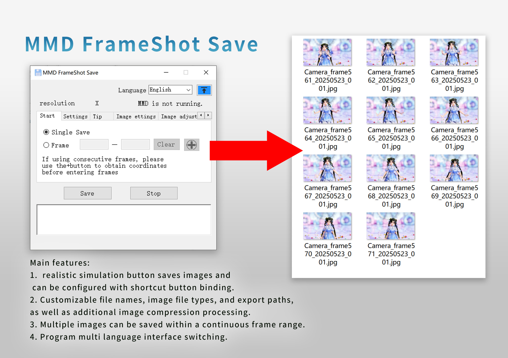

<h1 align="center">MMD FrameShot Save</h1>

<p align="center">
</p>
 
<p align="center">
  
    <br /><br />
    <a href="LICENSE"></a>
    <a href="https://github.com/SaraKale/MMD_FrameShot_Save/releases"></a>
    <a href=""></a>
    <a href=""></a>
</p>

<p align="center">
language：<a href="README.md">简体中文</a> | <a href="README_tc.md">繁體中文</a>  | <a href="README_jp.md">日本語</a>
</p>

## Introduction

This is a small tool for quickly saving images in MMD, eliminating the tedious process of manual image saving.

## Key Features

- Simulates real keystrokes to save images with configurable hotkey bindings.
- Supports custom file names, image formats, export paths, and additional image compression.
- Allows saving multiple images within a continuous frame range.
- Features multilingual interface switching.

## Video Tutorials

youtube：https://youtu.be/ArlKdYcY-cU  
bilibili：https://www.bilibili.com/video/BV1XKj7zFEPN/

## Download

Choose any download node below.

|   Node    |                                     Link                                    |
| :------: | :-----------------------------------------------------------------------: |
|  Github  | [releases](https://github.com/SaraKale/MMD_FrameShot_Save/releases) |
|  Gitee   | [releases](https://gitee.com/sarakale/MMD_FrameShot_Save/releases)  |
| bowlroll |                  [Link](https://bowlroll.net/file/336692)                  |
| aplaybox |        [Link](https://www.aplaybox.com/details/model/GFMFCDPvlKwf)         |
| lanzouu  |            [Link](https://wwiu.lanzouu.com/b0raa15wb) Password:dqhm            |

## System Requirements

OS: Windows 7 SP1 or later

Requires Microsoft .NET Framework 4.8 runtime  
Download: https://dotnet.microsoft.com/en-us/download/dotnet-framework/net48

## Build Instructions

Development environment:  
OS: Windows 10  
IDE: [Visual Studio 2022](https://visualstudio.microsoft.com/)  
Framework: .NET Framework 4.8  
Language: C# 12.0  
Required NuGet packages:  
 - [MouseKeyHook](https://github.com/gmamaladze/globalmousekeyhook)

Additional required programs:
- [AutoHotkey](http://www.autohotkey.com)
- [imageMagic](https://imagemagick.org/index.php)

Place AutoHotkey in `bin\x64\Release\Script` and `bin\x86\Release\Script` folders.  
Place imageMagic's **magick.exe** in `bin\x64\Release` and `bin\x86\Release` folders.

Then compile `MMD FrameShot Save.sln` directly.

Alternatively, compile using **dotnet**:
```
dotnet build MMD FrameShot Save.csproj --framework net48
```

## Additional Configuration

The program requires compiled .ahk scripts for keyboard simulation.

- How to compile .ahk scripts:
    - Scripts are located in the `AHKScript` folder. Modify Sleep(500) values as needed.
    - Compile using `AutoHotkey_2.0.19\Ahk2Exe.exe`.
    - Or simply run `batchCompile.bat`.
    - Do not change file names, as the program relies on them.
    - SingleSave.ahk - For single frame capture
    - FrameRange_save.ahk - For continuous frame capture
	  
## Usage Instructions

- 1. Run **MMD FrameShot Save.exe** directly.  
  - Note: Only supports **MikuMikuDance 9.26** or later.  
  - Choose the version matching your MMD (32-bit or 64-bit).  
  - x32/MMD FrameShot Save_x32.exe for MikuMikuDance x86/x32bit  
  - x64/MMD FrameShot Save_x64.exe for MikuMikuDance x64bit  
  - To check your MMD version:
  - Right-click taskbar → Task Manager → Details → Right-click column headers → Select Columns → Check "Platform" → Find MikuMikuDance process.
  
- 2. Default language is English. Use the **Language** dropdown to switch.
  - The **"↑"** button toggles window always-on-top (default enabled).

- 3. The program will detect MMD's current resolution and frame number (for reference only).

- 4. Configure filename prefix, file type, and export path in the "`Settings`" tab.
  - Settings are saved in **config.ini**.
  - Filename format:
  - [Prefix]_[Frame]_[DateTime]_[Sequence].[Extension]
  - Example:
  - Camera_frame01_20250101_001.png
  - Supported formats:
  - bmp, jpg, png, dds, dib, pfm, hdr

- 5. Save delay (recommended ≥5000ms) accounts for MMD's slow saving process.
  - Time conversion:
  - 1000ms = 1s
  - 5000ms = 5s
  - 60000ms = 60s
  - MMD timeline supports up to 300,000 frames (~1h40m at 30FPS).

- 6. Hotkeys
  - Customizable as **Ctrl/Alt/Shift+Letter/FunctionKey**.
  - Avoid conflicts with MMD's existing hotkeys:
  - Alt+F, Alt+D, Alt+V, Alt+B, Alt+M, Alt+P, Alt+K, Alt+H

- 7. Auto-open folder:
  - Opens export folder after saving.

- 8. Single Frame Mode
  - Disables continuous frame capture.

- 9. Continuous Frames
  - Set start/end frames. Click "`+`" first to position cursor in the frame box.

- 10. Save Button
  - Automatically switches to English keyboard layout during operation.
  - For Windows 10, use `Alt+Shift` or `Win+Space` to switch to "UK/US Keyboard".

- 11. Pause Button
  - Interrupts continuous frame capture.

- 12. Image Compression
  - Adjust quality (1-100 for JPG/Webp/Avif, 1-9 for PNG).
  - Enable "Image Size" to resize (in pixels, e.g., 1920x1080).

## FAQ

Q: Modified hotkeys may trigger duplicate executions.  
A: Temporary solution - use the Save button instead.

## Notes

 - Commercial use prohibited.
 - Author not responsible for any issues arising from tool usage.

## Credits

- Libraries:
- MouseKeyHook      by:George Mamaladze
- https://github.com/gmamaladze/globalmousekeyhook

- Tools:
- AutoHotkey
- http://www.autohotkey.com
- imageMagic
- https://imagemagick.org/index.php

- AI Assistance:
- ChatGPT
- Github Copilot

- Icons:
- https://www.flaticon.com/

## License

[CC BY-NC-SA 4.0](LICENSE)