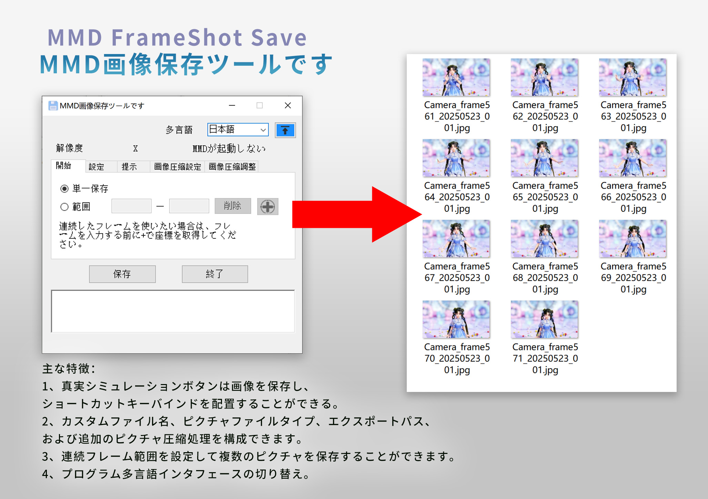

<h1 align="center">MMD FrameShot Save</h1>
<p align="center">
<font size="10px">MMD画像保存ツールです</font><br />
</p>
 
<p align="center">
  
    <br /><br />
    <a href="LICENSE"></a>
    <a href="https://github.com/SaraKale/MMD_FrameShot_Save/releases"></a>
    <a href=""></a>
    <a href=""></a>
</p>

<p align="center">
言語： <a href="README_en.md">English</a> | <a href="README.md">简体中文</a> | <a href="README_tc.md">繁體中文</a>
</p>

## 概要

MMDで画像を素早く保存するためのツールです。手動での保存作業を簡略化します。

## 主な機能

- キー操作をシミュレートして画像保存（ショートカットキー設定可能）
- ファイル名、画像形式、出力パスのカスタマイズと画像圧縮機能
- 連続フレーム範囲指定での一括保存
- 多言語インターフェース対応

## 動画チュートリアル

youtube：https://youtu.be/ArlKdYcY-cU  
bilibili：https://www.bilibili.com/video/BV1XKj7zFEPN/

## ダウンロード

以下のいずれかからダウンロード可能です。

|    ノード    |                                     リンク                                     |
| :---------: | :--------------------------------------------------------------------------: |
|   Github   | [releases](https://github.com/SaraKale/MMD_FrameShot_Save/releases) |
|   Gitee    | [releases](https://gitee.com/sarakale/MMD_FrameShot_Save/releases)  |
|  bowlroll  |                   [リンク](https://bowlroll.net/file/336692)                   |
| aplaybox |        [リンク]()         |
| lanzouu  |            [リンク](https://wwiu.lanzouu.com/b0raa15wb) パスワード:dqhm            |

## 動作環境

OS：Windows 7 SP1 以降

Microsoft .NET Framework 4.8 が必要  
ダウンロード：https://dotnet.microsoft.com/ja-jp/download/dotnet-framework/net48

## ビルド方法

開発環境：  
OS：Windows 10  
IDE：[Visual Studio 2022](https://visualstudio.microsoft.com/ja/)  
フレームワーク：.NET Framework 4.8  
言語：C# 12.0  
必要なNuGetパッケージ：  
 - [MouseKeyHook](https://github.com/gmamaladze/globalmousekeyhook)

その他必要なプログラム：
- [AutoHotkey](http://www.autohotkey.com)
- [imageMagic](https://imagemagick.org/index.php)

AutoHotkeyは `bin\x64\Release\Script` と `bin\x86\Release\Script` フォルダに配置  
imageMagicの **magick.exe** は `bin\x64\Release` と `bin\x86\Release` フォルダに配置

その後 `MMD FrameShot Save.sln` をビルド

またはdotnetでビルド：
```
dotnet build MMD FrameShot Save.csproj --framework net48
```

## 追加設定

キーボード操作にはコンパイル済み.ahkスクリプトが必要です。

- .ahkスクリプトのコンパイル方法：
    - `AHKScript` フォルダ内のスクリプトを編集可能（Sleep(500)の値を調整）
    - `AutoHotkey_2.0.19\Ahk2Exe.exe` でコンパイル
    - または `batchCompile.bat` を実行
    - ファイル名は変更不可
    - SingleSave.ahk - 単一フレーム用
    - FrameRange_save.ahk - 連続フレーム用
	  
## 使用方法

- 1. **MMD FrameShot Save.exe** を実行  
  - **MikuMikuDance 9.26** 以降が必要  
  - MMDのビット数に合わせて選択：  
  - x32/MMD FrameShot Save_x32.exe → MikuMikuDance x86/x32bit版用  
  - x64/MMD FrameShot Save_x64.exe → MikuMikuDance x64bit版用  
  - MMDのビット数を確認：
  - タスクバー右クリック → タスクマネージャー → 詳細 → 列タイトル右クリック → 「プラットフォーム」を選択 → MikuMikuDanceプロセスを確認
  
- 2. 右上の **Language** で日本語に切り替え可能
  - 「↑」ボタンでウィンドウの最前面表示を切り替え（初期状態はON）

- 3. MMDの現在の解像度とフレーム数を自動検出（参考値）

- 4. 「`設定`」タブでファイル名プレフィックス、形式、出力パスを設定
  - 設定は **config.ini** に保存
  - ファイル名形式：
  - [プレフィックス]_[フレーム]_[日時]_[連番].[拡張子]
  - 例：
  - Camera_frame01_20250101_001.png
  - 対応形式：
  - bmp、jpg、png、dds、dib、pfm、hdr

- 5. 保存間隔（推奨5000ms以上）
  - 時間換算：
  - 1000ms = 1秒
  - 5000ms = 5秒
  - 60000ms = 60秒
  - MMDの最大フレーム数：300,000フレーム（30FPSで約1時間40分）

- 6. ショートカットキー
  - **Ctrl/Alt/Shift+英字/ファンクションキー** で設定可能
  - MMDの既存ショートカットと競合しないように注意：
  - Alt+F、Alt+D、Alt+V、Alt+B、Alt+M、Alt+P、Alt+K、Alt+H

- 7. 保存後フォルダを自動的に開く

- 8. 単一フレームモード
  - 連続フレーム機能を無効化

- 9. 連続フレーム
  - 開始/終了フレームを設定。「`+`」ボタンでフレーム操作ボックスにフォーカス

- 10. 保存ボタン
  - 自動的に英語キーボードに切り替え
  - Windows 10では `Alt+Shift` または `Win+Space` で「英語（UK/US）キーボード」に切り替え

- 11. 一時停止ボタン
  - 連続保存を中断

- 12. 画像圧縮
  - JPG/Webp/Avif：品質1-100（推奨75-95）
  - PNG：圧縮レベル1-9
  - 「画像サイズ」で解像度変更可能（例：1920x1080）

## よくある質問

Q：ショートカットキーを変更すると重複実行される  
A：一時的な解決策 - 保存ボタンを使用してください

## 注意事項

 - 商用利用禁止
 - 本ツールの使用に関して発生したいかなる問題についても作者は責任を負いません

## クレジット

- 使用ライブラリ：
- MouseKeyHook      by:George Mamaladze
- https://github.com/gmamaladze/globalmousekeyhook

- ツール：
- AutoHotkey
- http://www.autohotkey.com
- imageMagic
- https://imagemagick.org/index.php

- AI支援：
- ChatGPT
- Github Copilot

- アイコン：
- https://www.flaticon.com/

## ライセンス

[MIT License](LICENSE)