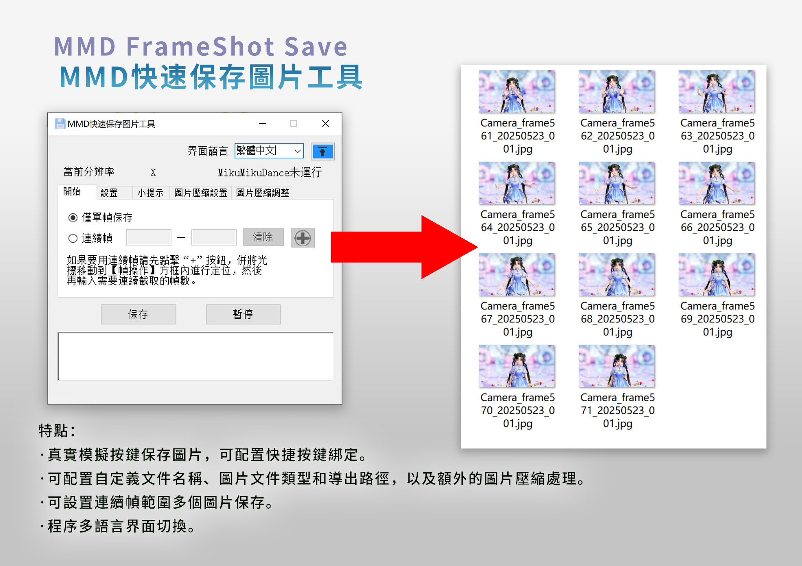

<h1 align="center">MMD FrameShot Save</h1>

<p align="center">
<font size="10px">MMD快速保存圖片工具</font><br />
</p>
 
<p align="center">
  
    <br /><br />
    <a href="LICENSE"></a>
    <a href="https://github.com/SaraKale/MMD_FrameShot_Save/releases"></a>
    <a href=""></a>
    <a href=""></a>
</p>

<p align="center">
language：<a href="README_en.md">English</a> | <a href="README.md">简体中文</a>  | <a href="README_jp.md">日本語</a>
</p>

## 介紹

這是用於在MMD快速保存圖片的小工具，節省手動保存圖片的繁瑣流程。

## 主要特點

 - 真實模擬按鍵保存圖片，可配置快捷按鍵綁定。
 - 可配置自定義文件名稱、圖片文件類型和導出路徑，以及額外的圖片壓縮處理。
 - 可設置連續幀範圍多個圖片保存。
 - 程序多語言界面切換。

## 視頻教程

youtube：https://youtu.be/ArlKdYcY-cU  
bilibili：https://www.bilibili.com/video/BV1XKj7zFEPN/

## 下載

請選擇下面任意節點下載。

|   節點    |                                    鏈接                                    |
| :------: | :-----------------------------------------------------------------------: |
|  Github  | [releases](https://github.com/SaraKale/MMD_FrameShot_Save/releases) |
|  Gitee   | [releases](https://gitee.com/sarakale/MMD_FrameShot_Save/releases)  |
| bowlroll |                  [鏈接](https://bowlroll.net/file/336692)                  |
| aplaybox |        [鏈接]()         |
| lanzouu  |            [鏈接](https://wwiu.lanzouu.com/b0raa15wb) 密碼:dqhm            |

## 運行環境

操作系統要求：Windows 7 SP1 以及 更高系統版本

需要有 Microsoft .NET Framework 4.8 運行環境  
下載：https://dotnet.microsoft.com/zh-cn/download/dotnet-framework/net48

## 編譯構建

我的開發環境：  
系統：Windows 10  
環境：[Visual Studio 2022](https://visualstudio.microsoft.com/)  
框架：.NET Framework 4.8  
語言：C# 12.0  
需要安裝Nuget包：  
 - [MouseKeyHook](https://github.com/gmamaladze/globalmousekeyhook)

還有其他額外程序需要自己去下載：
- [AutoHotkey](http://www.autohotkey.com)
- [imageMagic](https://imagemagick.org/index.php)

AutoHotkey 放到 `bin\x64\Release\Script` 和 `bin\x86\Release\Script` 文件夾下。  
imageMagic 的 **magick.exe** 程序放到 `bin\x64\Release` 和 `bin\x86\Release` 文件夾下。

然後直接運行 `MMD FrameShot Save.sln` 編譯即可。

或者其他方式編譯，例如**dotnet**編譯：
```
dotnet build MMD FrameShot Save.csproj --framework net48
```

## 額外配置

由於我是需要借助 AutoHotkey 來編寫鍵盤輸入操作，程序需要調用 .ahk 腳本編譯後的文件，所以需要自行編譯 .ahk 腳本。

- 如何編譯 .ahk 腳本：
    - .ahk 腳本在 `AHKScript` 文件夾下，可根據需要修改 Sleep(500) 這段代碼的數值即可。
    - 使用 `AutoHotkey_2.0.19\Ahk2Exe.exe` 打開 .ahk 文件編譯即可。
    - 或者雙擊運行 `batchCompile.bat` 即可。
    - 不可更改文件名，否則程序無法讀取到腳本。
    - SingleSave.ahk - 用於單幀腳本
    - FrameRange_save.ahk - 用於連續幀的腳本
	  
## 使用方法

- 1、直接運行 **MMD FrameShot Save.exe** 程序即可。  
  - 需要註意：僅支持 **MikuMikuDance 9.26** 以上版本，較低版本不支持。  
  - MikuMikuDance有 `32位` 和 `64位` 區分，請選擇相對應的版本。  
  - x32/MMD FrameShot Save_x32.exe 對應 MikuMikuDance x86/x32bit 程序  
  - x64/MMD FrameShot Save_x64.exe 對應 MikuMikuDance x64bit 程序  
  - 如何得知自己的MMD是哪個平臺呢？
  - 在系統任務欄中按下鼠標右鍵點擊任務管理器，點擊“詳細信息”，在列標題右鍵點擊“選擇列”，找到“平臺”勾選，就會出現平臺選項了，往下找到MikuMikuDance的進程，就會看到對應哪個平臺了。
  
- 2、默認是English語言，在右上角選擇 **Language**可以切換到妳熟悉的語言。
  - 右側有個 **“↑”** 置頂按鈕，初次啟動程序默認是自動置頂，藍色常亮狀態，可以手動點擊按鈕取消置頂。

- 3、此時會讀取到 MikuMikuDance 窗口的當前分辨率和當前幀數，如果沒有數值也不要緊，只是作為參考，只是導出圖片不會包含幀號。

- 4、請先在“`設置`”標簽頁中設定文件名前綴、文件類型、導出路徑。
  - 設置好後會在程序目錄生成 **config.ini** 配置文件，會自動記錄設置，下次再打開程序就會讀取已保存好的設定。
  - 文件命名是這樣的格式：
  - [文件前綴]_[幀數]_[日期時間]_[序號].[擴展名]
  - 示例：
  - Camera_frame01_20250101_001.png
  - MMD支持導出的文件類型有：
  - bmp、jpg、png、dds、dib、pfm、hdr

- 5、保存等待時間是每壹次保存後的等待延遲，建議設置 `5000ms` 以上，因為MMD保存圖片較慢，可根據妳的機器運行速度適度調整。
  - 時間換算如下：
  - 1000ms = 1s
  - 5000ms = 5s
  - 60000ms = 60s
  - 另外MMD的時間軸最大可設置為 300,000 幀（約1小時40分鐘，按30FPS計算）。

- 6、快捷鍵
  - 可以自定義快捷鍵，只支持 **Ctrl/Alt/Shift+字母/功能鍵** 等，註意不要和MMD菜單欄已有的快捷鍵沖突，如果有沖突可更換其他按鍵。
  - 這是MMD已存在的按鍵：
  - Alt+F、Alt+D、Alt+V、Alt+B、Alt+M、Alt+P、Alt+K、Alt+H

- 7、保存後自動打開文件夾：
  - 當保存成功後會自動打開導出的文件夾。

- 8、僅單幀保存
  - 勾選此選項後會將連續幀功能關閉，只作為保存單次圖片使用。

- 9、連續幀
  - 這是可以設定起始幀到結束幀範圍的幀設定，如果要用連續幀請先點擊“`+`”按鈕，併將光標移動到【幀操作】方框內進行定位，然後再輸入需要連續截取的幀數。因為MMD無法在後臺內存操作，只能接受真實物理按鍵輸入，設定好後會顯示X和Y的坐標值了。

- 10、保存按鈕
  - 設定好後可以保存圖片了！此時會自動將系統輸入法切換到英文輸入法，如果沒有切換，請自己將輸入法切換到英文鍵盤狀態，如果是Window 10系統，請按下`Alt+Shift / Win + Space(空格)`鍵切換到“`英國鍵盤（UK）/美國鍵盤（US）`”，確保輸入法是**英文**鍵盤，這樣保存就不會有幹擾誤觸了。
  - 按下保存按鈕後此時程序會自動操作了，在此期間請耐心等待圖片保存完成，在下方會有日誌輸出。

- 11、暫停按鈕
  - 這是用來在使用連續幀時會用到的功能，可在中途強行暫停任務。

- 12、圖片壓縮
  - 這裏是可以同時壓縮圖片的設定，因為原始圖片較大，如果有需求可以開啟圖片壓縮。
  - 基本上看名稱就很好理解了。
  - JPG/Webp/Avif壓縮質量通常在 `1–100` 區間，數值越小壓縮越小，壹般建議設置 `75-95` 區間。
  - PNG壓縮級別也類似，最大壓縮級別為 `9`，數值越小壓縮越小。
  - 開啟“**圖片尺寸**”可調整圖像大小，以**px**像素為單位，數值分別是寬度和高度，如：1920x1080。

## 問題解答 FAQ

Q：快捷按鍵修改按鍵後可能會重複運行。  
A：暫時無法解決，請臨時用保存按鈕吧。

## 使用事項

 - 禁止任何商業性質行為
 - 關於使用工具產生的任何問題，作者概不負責。

## 來源

- 使用庫：
- MouseKeyHook      by:George Mamaladze
- https://github.com/gmamaladze/globalmousekeyhook

- 工具：
- AutoHotkey
- http://www.autohotkey.com
- imageMagic
- https://imagemagick.org/index.php

- AI代碼輔助：
- ChatGPT
- Github Copilot

- 圖標：
- https://www.flaticon.com/

## 許可證

使用 [MIT License](LICENSE) 許可證
